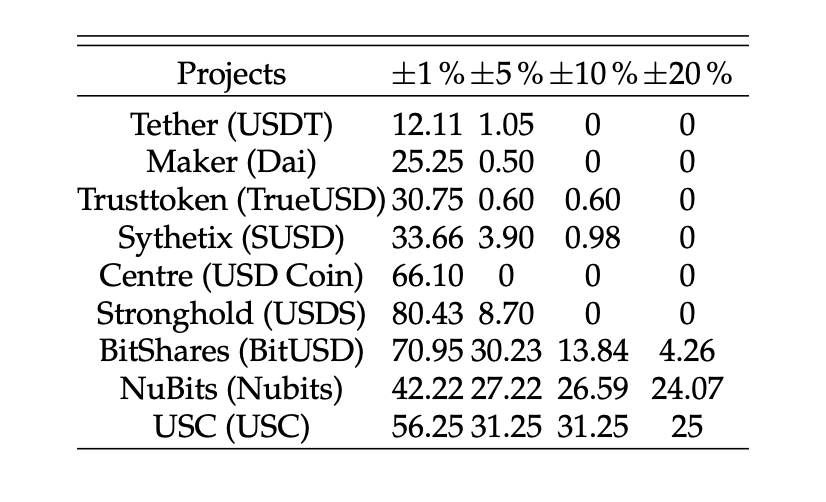

[](http://quantlet.de/)

## [](http://quantlet.de/) **msic-dasoq_2019_04_violations** [](http://quantlet.de/)

```yaml

Name of Quantlet: msic-dasoq_2019_04_violations

Published in: 'Monetary stabilization in cryptocurrencies–design approaches and open questions (Pernice et al., 2019)'

Description: "This quantlet calculates peg-deviations for the stable coins that are already traded and gives a descriptive table."

Keywords: stablecoins, peg-deviations, plot, bitcoin, pricing, economics, stablecoin

Author: Ingolf Pernice, Sebastian Henningsen, Roman Proskalovich, Martin Florian, Hermann Elendner, Björn Scheuermann 

See also: other Quantlets in this project

Submitted: 12.09.2023

Datafile: "table_stablecoin.org (a representation of the survey results), data.Rda (the output of the quantlet msic-dasoq_2019_02_prepare_data)"


```



### R Code
```r

####################################################
### STEP 1: PACKAGES & OPTIONS
####################################################

##### Load packages ####

list_of_packages <- c("httr", "jsonlite", "tidyr", "lubridate", "dplyr", "curl", "ggplot2", "moments", "xts", "data.table", "psych", "stargazer", "tikzDevice") # "tikz"

new_packages <- list_of_packages[!(list_of_packages %in% installed.packages()[,"Package"])]
if(length(new_packages)){
  install.packages(new_packages)
} else {
  lapply(list_of_packages, require, character.only = TRUE)       
  # (Thanking: https://stackoverflow.com/questions/4090169/elegant-way-to-check-for-missing-packages-and-install-them)
}

##### Settings Object #####
SETTINGS <- list()
SETTINGS$coins <- c(
  "ethereum",
  "tether",
  "trueusd",
  "digix-gold-token",
  "nubits",
  "bitusd",
  "karbo",
  "steem-dollars",
  "bitcoin",
  "stasis-eurs",
  "bitshares",
  "nushares",
  "usd-coin",
  "stronghold-usd",
  "ckusd",
  "usdcoin",
  #"stableusd", 
  "dai",
  "minexcoin",
  "susd")
SETTINGS$date_start <- "1400000000000"
SETTINGS$date_end   <- "1549474383067" #.getTimestamp() #Note: timestamp needs to be frozen, to find the files.


####################################################
### STEP 2: HELPER FUNCTIONS
####################################################
.extractCoins <- function(mixedvec){
  rn <- mixedvec
  rnnew <- NULL
  for(i in 1:length(rn)){ rnnew <- c(rnnew, gsub("[\\(\\)]", "", regmatches(rn, gregexpr("\\(.*?\\)", rn))[[i]]) )}
  return(rnnew)
}

.extractProjects <- function(mixedvec){
  rn <- mixedvec
  rnnew <- gsub("\\s*\\([^\\)]+\\)","",rn)
  return(rnnew)
}


makeDescTblForAll <- function(dta = data_list_nooutliers,
                              subselection = NULL){
  xts_list <- lapply(dta, getXTS)
  df <- xts_list[[1]]$price_usd
  
  .getDescTbl <- function(df,
                          vars){
    tbl <- NULL
    for(var in vars){
      df_sub <- df[,var]
      row <- psych::describe(df_sub)
      tbl <- rbind(tbl, row)
    }
    rownames(tbl) <- vars
    return(tbl)    
  }
  
  ## write table
  desctbls <- lapply(xts_list, .getDescTbl, c("price_usd"))
  desctbls <- do.call(rbind, desctbls)
  
  ## add daily average volatility
  desctbls$dailyvol_avg <- unname(unlist(lapply(data_list, function(x){mean(x[["vol.squaredreturns"]])})))
  
  ## select rows and columns
  desctbls <- desctbls[ ,c("n", "mean", "min", "max", "sd", "dailyvol_avg")]
  colnames(desctbls) <- c("Obs.", "Mean","Min.", "Max.", "Vol. (annualized)", "Vol. (daily averaged)")
  
  if(is.null(subselection) == FALSE){
    desctbls <- desctbls[subselection, ]
  }
  
  return(desctbls)
}


getDesc.element <- function(vec){
  desc <- list()
  vec <- as.vector(vec)
  
  desc[["mean"]] <- mean(vec)
  desc[["sd"]] <- sd(vec)
  desc[["skewness"]] <- skewness(vec)
  desc[["median"]] <- median(vec)
  
  desc <- lapply(desc, round, digits = 4)
  
  return(desc)
}                            # sd boundaries

getDesc <- function(df){
  
  cnames <- colnames(df)
  desc <- lapply(df, getDesc.element)
  
  return(desc)
  
}

getXTS <- function(df, name_of_time_col = "timestamp"){
  df.xts <- xts(df[ ,!colnames(df) %in% name_of_time_col],
                order.by=df[ ,name_of_time_col])
  
  return(df.xts)
}

dictNamesFromIndex <- function(tbl,
                               indexname_vec){
  
  
  
  beautinames <- sapply(indexname_vec,
                        function(x){tbl[tbl$Index == x, "Project (Stabilized Token)"]})
  
  return(beautinames)
}

.extractCoins <- function(mixedvec){
  rn <- mixedvec
  rnnew <- NULL
  for(i in 1:length(rn)){ rnnew <- c(rnnew, gsub("[\\(\\)]", "", regmatches(rn, gregexpr("\\(.*?\\)", rn))[[i]]) )}
  return(rnnew)
}
.extractProjectnames <- function(mixedvec){
  rn <- mixedvec
  rnnew <- gsub("\\s*\\([^\\)]+\\)","",rn)
  return(rnnew)
}

extractSubSec <- function(tbl,
                          col,
                          choice){
  subsel <- tbl[tbl[ ,col] == choice, "Index"]
  
  return(subsel)
}

makeDevTable <- function(dlist = data_list,
                         peg = peg,
                         devs = devs){
  
  .makeDev <- function(peg, devs, data_vec){
    viol_perc <- sapply(devs, function(dev){round(sum(data_vec < peg - dev | data_vec > peg + dev)/length(data_vec), digits = 4)*100})
    names(viol_perc) <- devs
    return(viol_perc)
  }
  dev_list <- lapply(dlist, function(l){.makeDev(l[["price_usd"]],
                                                 peg = peg,
                                                 devs = devs)})
  tbl <- t(as.data.frame(dev_list, check.names = FALSE))
  tbl <- round(tbl, digits = 2)
  tbl <- tbl[order(rowSums(tbl)), ]
  return(tbl)
}

####################################################
### STEP 4: LOAD DATA
#################################################### 
setwd("/Users/ingolfpernice/Documents/msic-dasoq_2019/msic-dasoq_2019_04_violations")
load("data.Rda")
tbl <- readOrg("./table_stablecoin.org")
tbl_traded <- tbl[ grepl(x=tbl[ ,"Listed on Coinmarketcap"], pattern="Yes"), ]

####################################################
### STEP 5: SCRIPT
#################################################### 
## table of violations

## static characteristics
                                        # set peg
peg <- 1
                                        # set dev vec
devs <- c(0.01, 0.05, 0.1, 0.2)
                                        # set selection of coins
selection <- extractSubSec(tbl = tbl_traded,
                           col = "Monetary Regime",
                           choice = "ERT")

selection <- selection[!grepl(x=selection, pattern="digix|eurs")]  
                                        # make table
devtbl <- makeDevTable(dlist = data_list[selection],
                       peg = peg,
                       devs = devs)
                                        # read names from dictionary
rownames(devtbl) <- dictNamesFromIndex(tbl,
                                       rownames(devtbl))
##                                         # extract coin names
## rownames(devtbl) <- .extractProjectnames(unname(rownames(devtbl)))
## colnames(devtbl)[1] <- "Project"

                                        # make labels
lbls <- c("Projects"
         ,"\\SI{\\pm 1}{\\percent}"
         ,"\\SI{\\pm 5}{\\percent}"
         ,"\\SI{\\pm 10}{\\percent}"
         ,"\\SI{\\pm 20}{\\percent}")

## table to latex
stargazer(devtbl
         ,digits = 2 
         ,summary  = FALSE
         ,covariate.labels = lbls 
         ,title    = "Descriptive statistics for implemented stablecoin projects"
         ,out      = "./violations.tex"
         ,float    = FALSE
         ,column.sep.width = "-7pt"  
          )

```

automatically created on 2023-09-21